# Rebekah Heal Portfolio Website

**Website** (no link yet)

[**GIT Repository**](https://github.com/rheal3/RebekahHeal_T1A2)

## Description

**Purpose**: The purpose of this website is to showcase my personality and projects
to perspective employers and provide different methods of contact.

**Functionality/Features**:
- Pages display on both mobile and desktop screens.
- Downloadable PDF of resume.
- Clear minimalist design.

**Sitemap**:
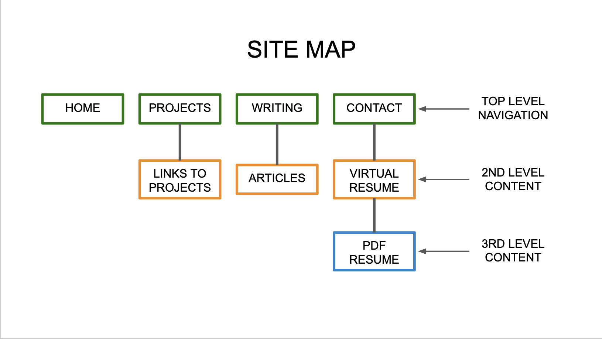

**Screenshots**:

- Wireframes:
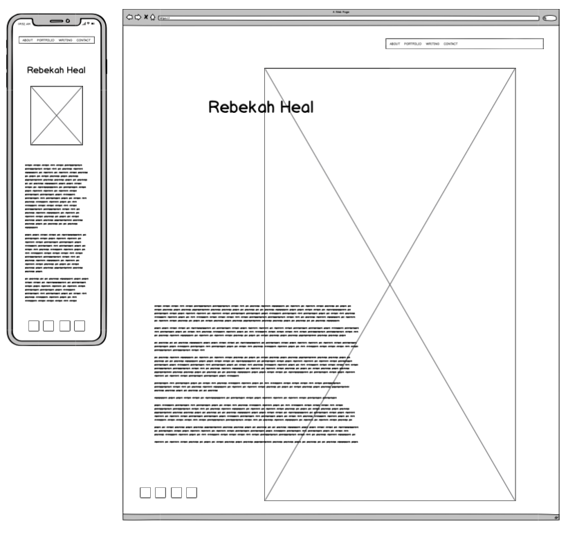
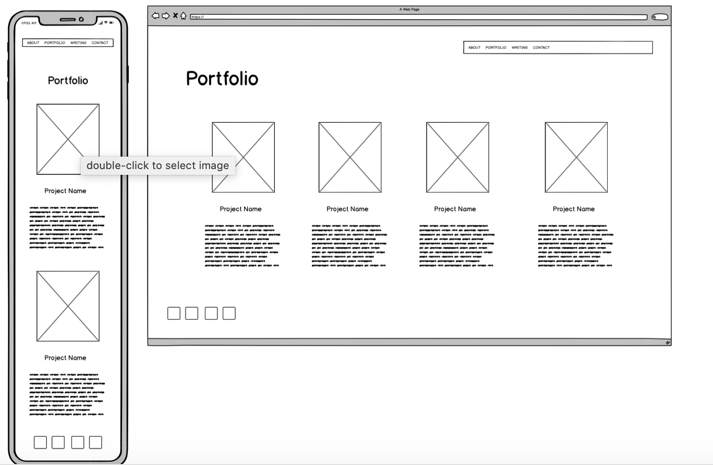
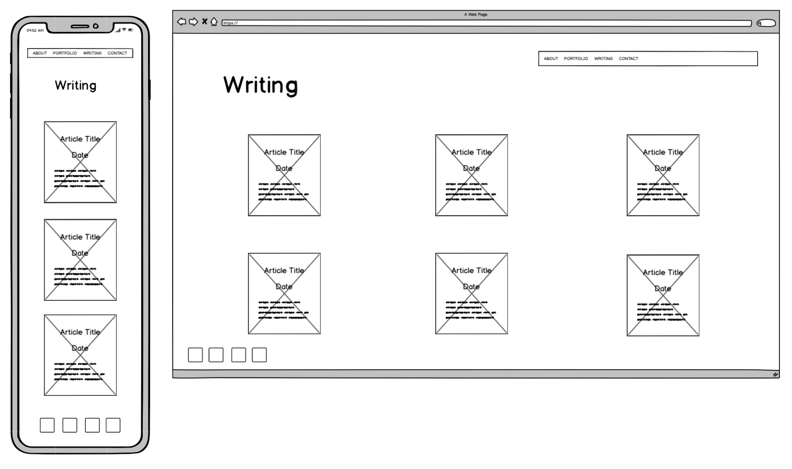
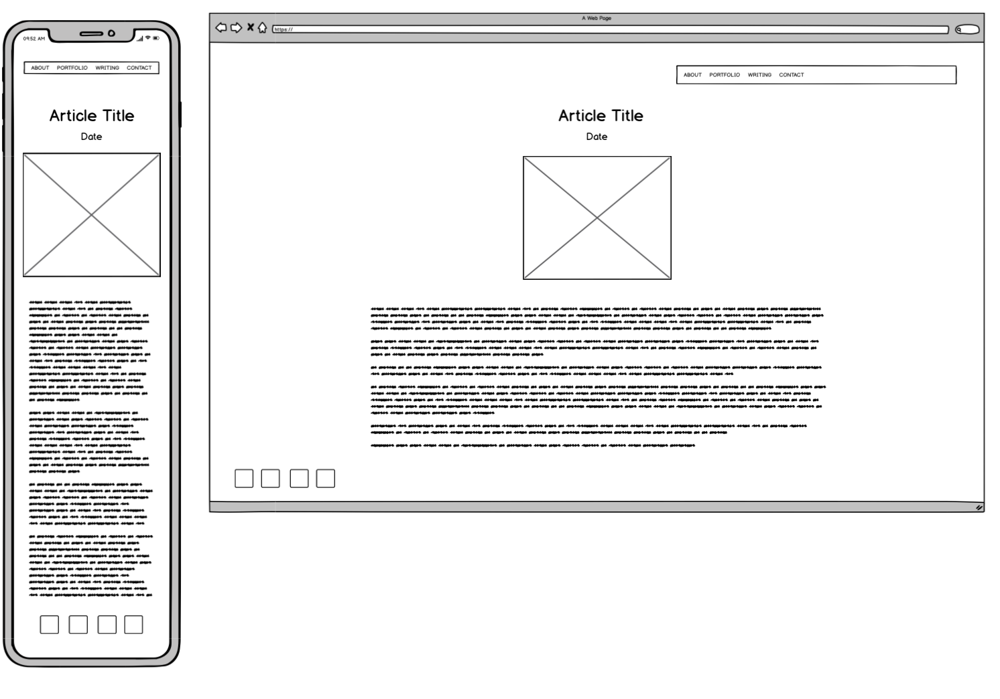
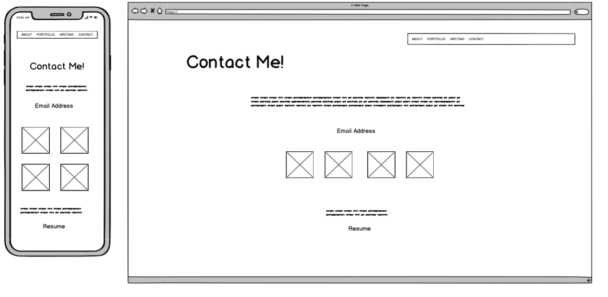
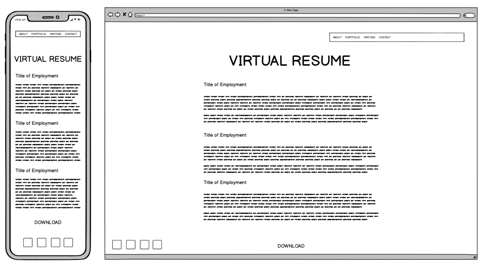

- Inspiration:

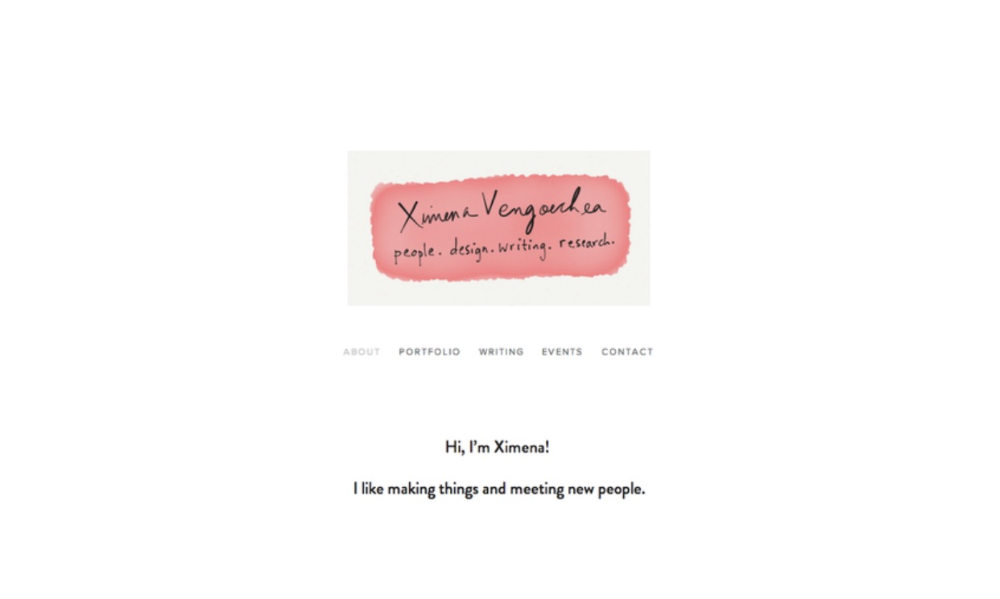
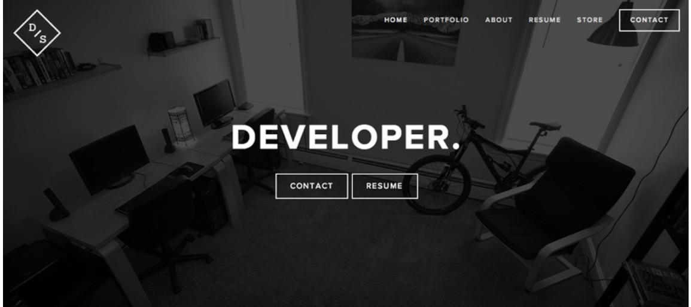

- Outcome:
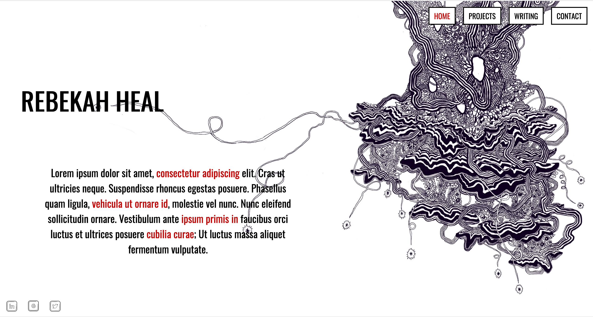
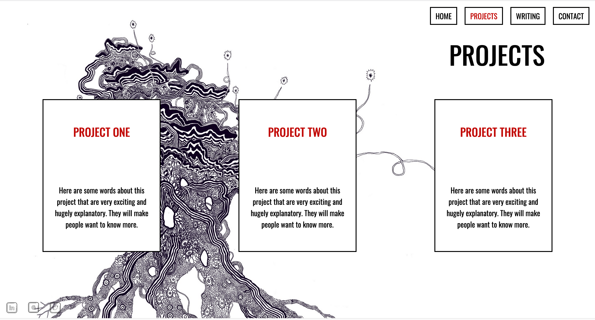

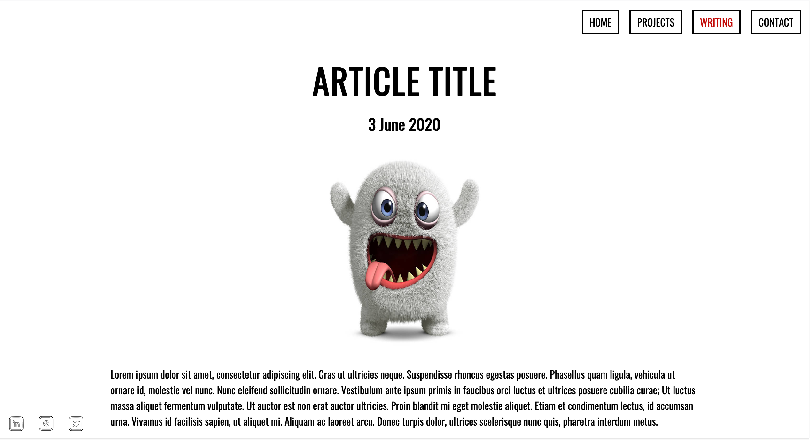
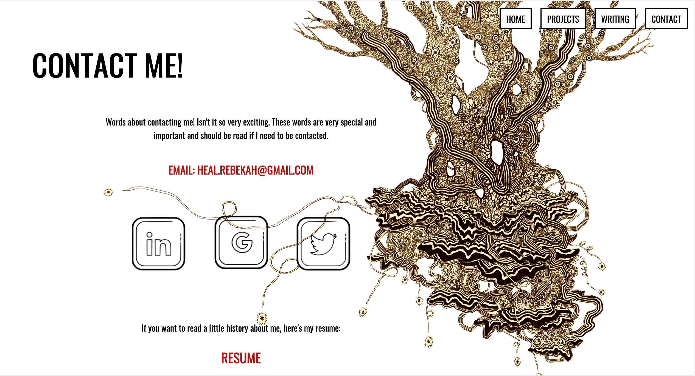
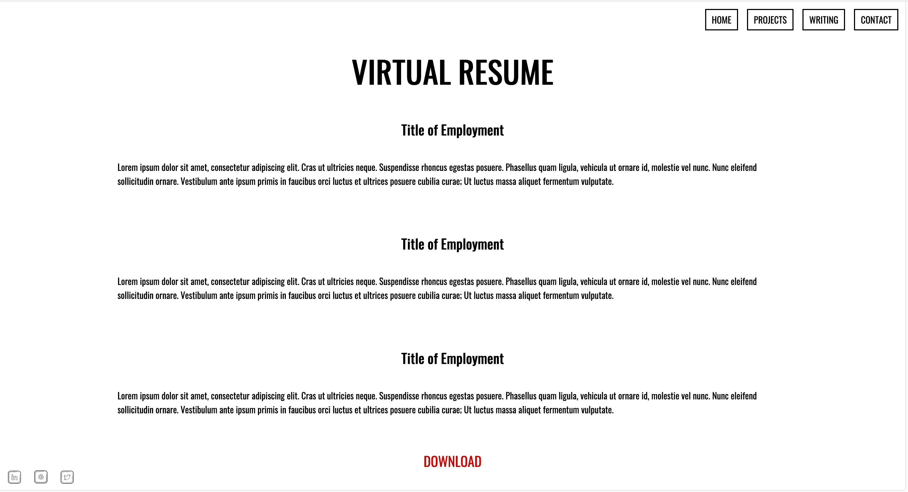

**Target Audience**: Perspective employers in the field of cyber security.

**Tech Stack**: html, css, markdown
