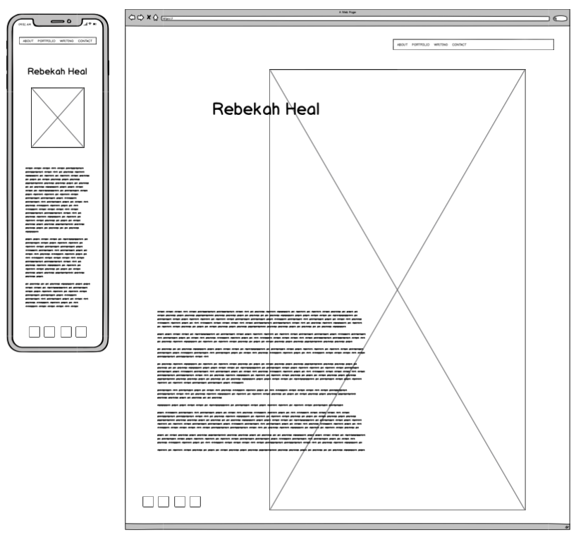
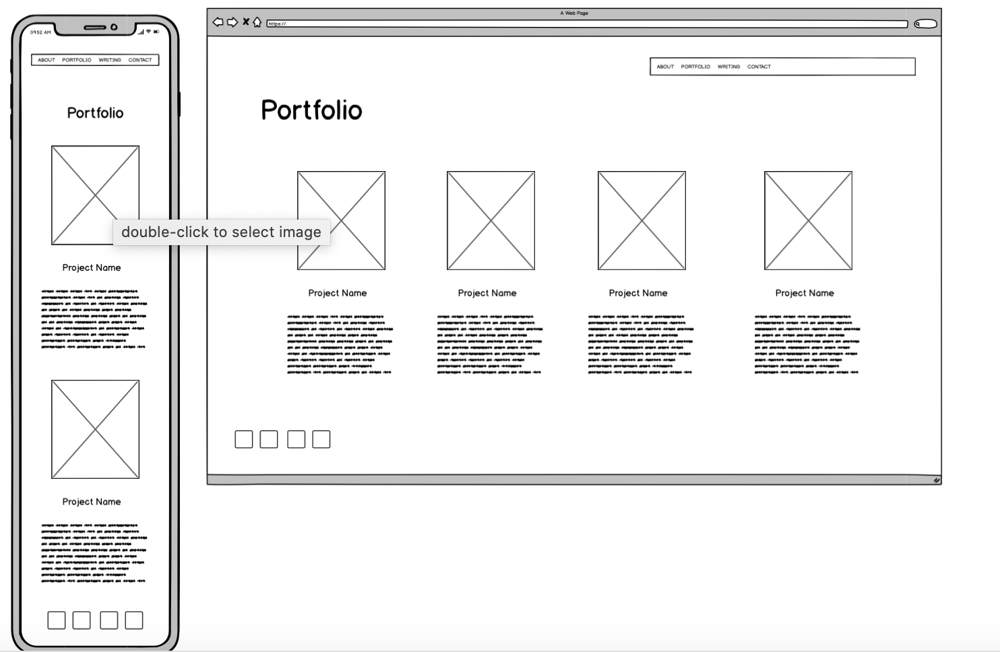
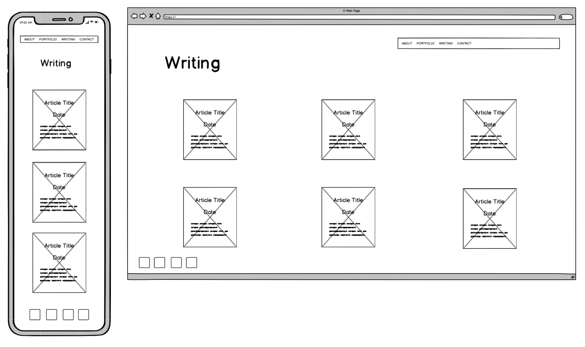
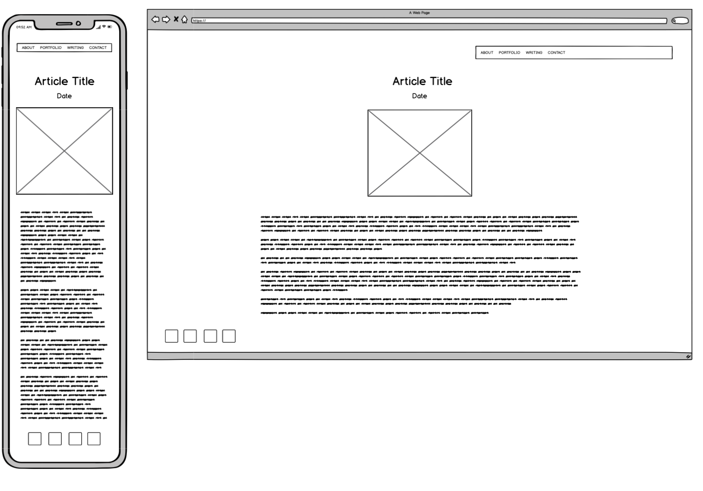
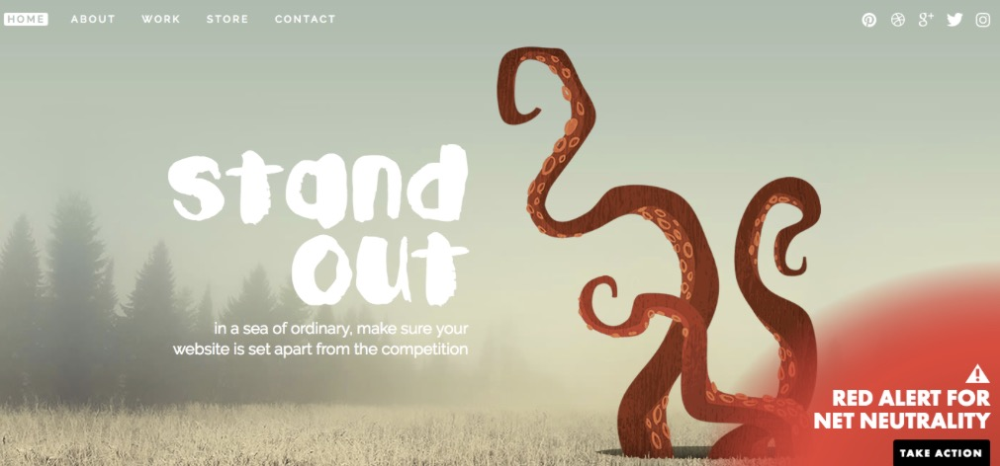
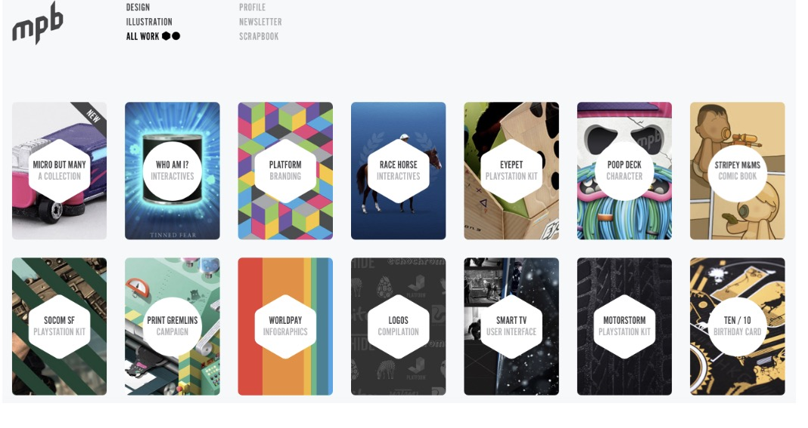
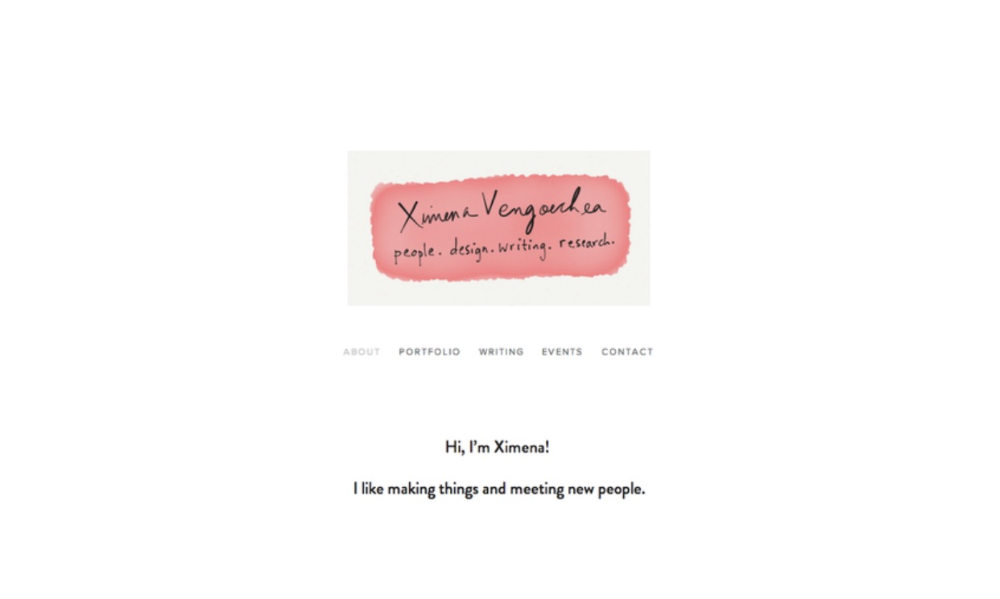

# Rebekah Heal Portfolio Website

**Website**: 

**GIT Repository**:

## Description

**Purpose**: show my personality and projects to perspective employers, provide different methods of contact.

**Functionality/Features**:

**Sitemap**:

**Screenshots**:

- Wireframes:

- Inspiration:

- Outcome:

**Target Audience**: employers in cyber security.

**Tech Stack**: html, css,
