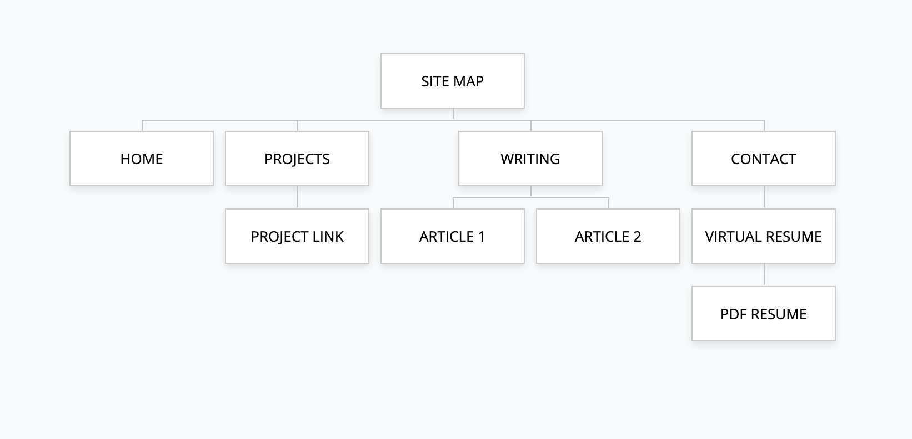
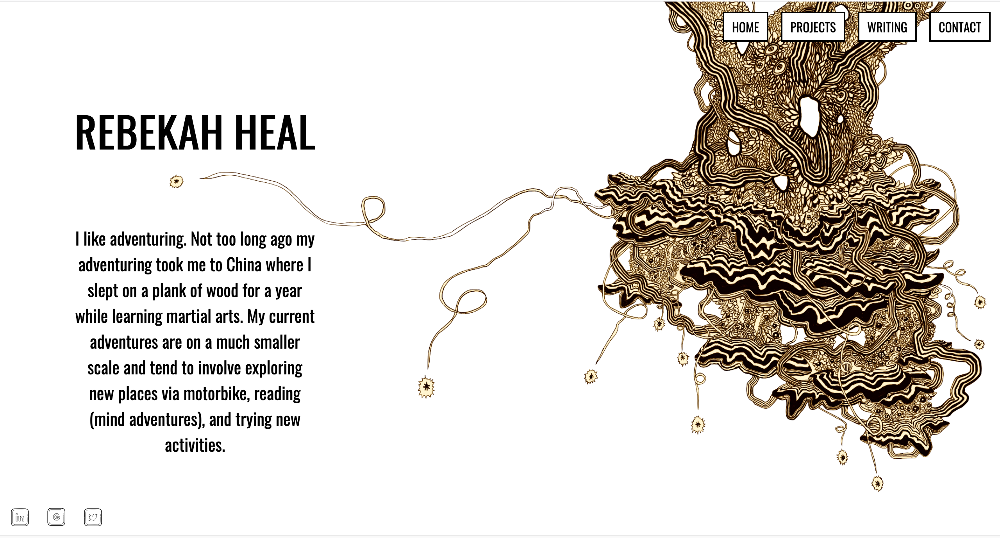
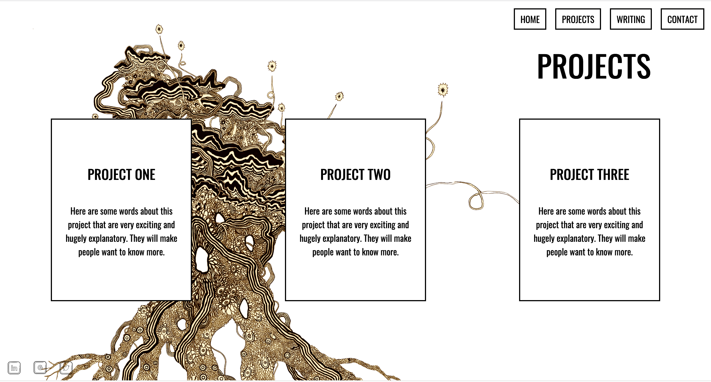
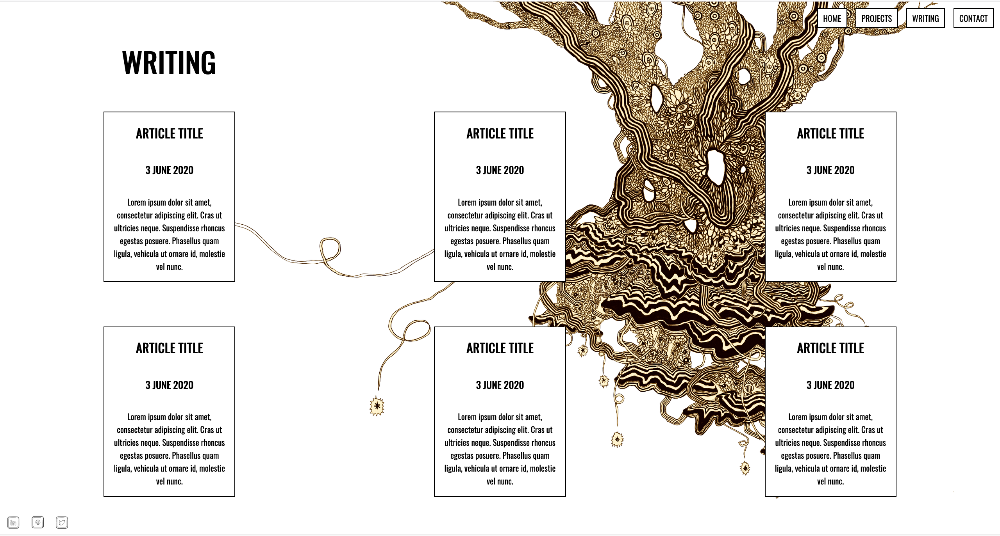

# Rebekah Heal Portfolio Website

[**GIT Repository**](https://github.com/rheal3/RebekahHeal_T1A2)

## Description

**Purpose**: The purpose of this website is to showcase my personality and projects
to perspective employers and provide different methods of contact.

**Functionality/Features**:
- Pages display on both mobile and desktop screens.
- Downloadable PDF of resume.
- Clear minimalist design.

**Sitemap**:

**Screenshots**:

- **Inspiration**:

- **Wireframes**:

- **Outcome**:

**Target Audience**: Perspective employers in the field of cyber security.

**Tech Stack**: html, css, markdown

**NOTE**: If CSS does not render on page remove SRI hash from HTML.
